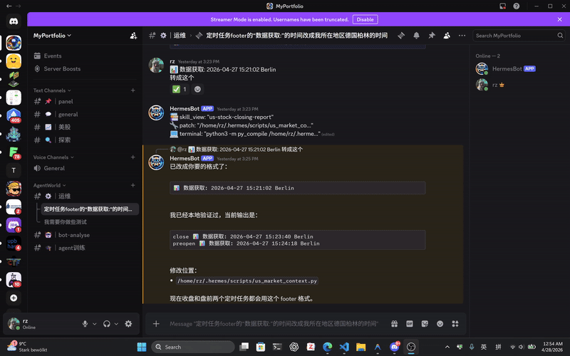

# Hermes Skill Scoring Support Tool

[English](README.md) | [中文](README_zh.md)
[](./README.md)
[](./README.md)
[](./README.md)
[](./README.md)

Infrastructure for **manual Hermes Agent skill review on Discord**.

This project captures the Discord `message_id` of a visible Hermes reply, maps it back to the correct Hermes `turn_id`, and provides the foundation required for **human-in-the-loop skill scoring**.

---

## Overview

When a user reacts to a Hermes reply in Discord, the scoring system needs to know **which Hermes turn is actually being judged**.

That sounds simple, but in practice one logical Hermes turn may produce:

- one standard visible Discord reply
- multiple split Discord message chunks
- a tool-phase message plus a final text reply

Hermes knows the outbound Discord `message_id` at send time, but it does not natively persist a durable `message_id -> turn_id` mapping for downstream review workflows.

This repository fills that gap.

## Why this exists

The long-term goal is to let users **manually score the skills used by Hermes Agent**.

Examples of future review actions:

- `✅` = good
- `❌` = not good
- `👌` = okay

But before any scoring workflow can be trusted, the system must reliably answer:

```text
Which Hermes turn does this Discord message belong to?
```

This repo focuses on solving that first.

---

## Features

- **Core Mapper**: Hooks Hermes Gateway at startup to record `discord_message_id -> turn_id` mappings in SQLite. It patches `DiscordAdapter.send()` to capture outbound results, handles split/chunked replies, and provides a CLI for local inspection and delayed reconciliation.
- **Reference Sidecar Bot**: A fully-functional bot that enables a reaction-based manual scoring workflow (`✅ / ❌ / 👌`). It enforces one score per turn, mirrors reactions across sibling Discord messages, and stores human reviews in a separate audit database.
- **Planned**: Export/reporting helpers, dashboards, and aggregate views by skill, score, and date range.

---

## Architecture & Flow

1. **Mapping**: When Hermes sends a Discord reply, the core mapper captures the outbound Discord `message_id`, resolves the session context, and writes a `message_id -> turn_id` mapping to `discord_turn_map.db`.
2. **Reviewing**: The sidecar review bot watches for user reactions on these replies, resolves the exact Hermes turn using the mapping database, reconstructs the skill usage from `~/.hermes/state.db`, and persists the human review in an audit database.
3. **Analytics**: Downstream tools can later analyze the audit database to reconstruct skill usage and aggregate review outcomes.

By using a stable `<session_id>:<assistant_db_id>` identifier as the `turn_id`, the system ensures manual scoring happens at the **Hermes turn level** rather than the raw message level. This prevents duplicate scores on split replies and confusion between tool-phase and final messages.

---

## Repository layout

```text
/path/to/hermes-discord-skill-audit/
  mapper.py                      # Core mapping logic & DiscordAdapter patch
  inspect_map.py                 # Local CLI for inspection & reconciliation
  data/discord_turn_map.db       # Generated SQLite mapping database
  examples/reaction_audit_bot.py # Reference bot for reaction-based scoring
  .env.example                   # Environment template for the reference bot

~/.hermes/hooks/discord-turn-map/
  HOOK.yaml                      # Gateway startup hook registration
  handler.py                     # Hook entrypoint to load mapper.py
```

---

## Quick start

### 0) Install dependencies (using uv)

This project uses `uv` for fast dependency management. If you don't have `uv` installed, [install it first](https://docs.astral.sh/uv/).
Then, set up the project environment:

```bash
uv sync
```

### 1) Create the Hermes hook directory

```bash
mkdir -p ~/.hermes/hooks/discord-turn-map
```

### 2) Create `HOOK.yaml`

Path:

```text
~/.hermes/hooks/discord-turn-map/HOOK.yaml
```

Content:

```yaml
name: discord-turn-map
summary: Persist Discord message_id -> Hermes turn_id mappings on gateway startup.
events:
  - gateway:startup
```

### 3) Create `handler.py`

Path:

```text
~/.hermes/hooks/discord-turn-map/handler.py
```

Content:

```python
from __future__ import annotations

import importlib.util
import logging
from pathlib import Path

LOGGER = logging.getLogger("discord-turn-map-hook")
PROJECT_DIR = Path("/path/to/hermes-discord-skill-audit")
MAPPER_PATH = PROJECT_DIR / "mapper.py"
_MODULE = None


def _load_mapper_module():
    global _MODULE
    if _MODULE is not None:
        return _MODULE
    spec = importlib.util.spec_from_file_location("hermes_discord_turn_map", MAPPER_PATH)
    if spec is None or spec.loader is None:
        raise RuntimeError(f"Could not load mapper from {MAPPER_PATH}")
    module = importlib.util.module_from_spec(spec)
    spec.loader.exec_module(module)
    _MODULE = module
    return module


async def handle(event_type: str, context: dict):
    if event_type != "gateway:startup":
        return
    module = _load_mapper_module()
    installed = module.install_patch()
    LOGGER.info("discord-turn-map hook initialized: installed=%s", installed)
```

### 4) Restart Hermes Gateway

The hook is loaded on `gateway:startup`, so the gateway must be restarted after creating or updating the hook.

If you do not restart Hermes Gateway, no new mappings will be recorded. Once restarted, the mapper database (`data/discord_turn_map.db`) will be automatically created.

### 5) Run the Sidecar Bot

To actually capture human reactions and record scores, start the Discord bot in examples folder.(ensure the bot has read/write message and rection permission)

Ensure you have copied `.env.example` to `.env` and filled in your `DISCORD_BOT_TOKEN`, then start the bot:

```bash
uv run examples/reaction_audit_bot.py
```

Now, when you react with `✅`, `❌`, or `👌` to a Hermes reply in Discord, the bot will resolve the mapping and record the skill score in `data/skill_audit.db`.

---

## Usage

### Show recent rows

```bash
python3 /path/to/hermes-discord-skill-audit/inspect_map.py --limit 20
```

### Show only pending rows

```bash
python3 /path/to/hermes-discord-skill-audit/inspect_map.py --status pending --limit 20
```

### Query a specific Discord message ID

```bash
python3 /path/to/hermes-discord-skill-audit/inspect_map.py --message-id 1497000000000000000
```

### Reconcile delayed pending rows

```bash
python3 /path/to/hermes-discord-skill-audit/inspect_map.py \
  --reconcile \
  --window-seconds 180 \
  --lookback-seconds 3600
```

---

## Mapping database

The SQLite table created by `mapper.py` is:

```sql
CREATE TABLE IF NOT EXISTS discord_message_turn_map (
  discord_message_id TEXT PRIMARY KEY,
  session_key TEXT,
  session_id TEXT,
  thread_id TEXT,
  chat_id TEXT,
  platform TEXT NOT NULL DEFAULT 'discord',
  turn_id TEXT,
  assistant_db_id INTEGER,
  reply_to_message_id TEXT,
  is_first_chunk INTEGER NOT NULL DEFAULT 0,
  chunk_index INTEGER NOT NULL DEFAULT 0,
  status TEXT NOT NULL DEFAULT 'pending',
  resolution_source TEXT,
  last_error TEXT,
  sent_at REAL NOT NULL,
  resolved_at REAL,
  created_at REAL NOT NULL,
  updated_at REAL NOT NULL
);
```

### Important fields

- `discord_message_id` — visible Discord message ID
- `session_id` — Hermes session identifier
- `turn_id` — resolved Hermes turn identifier
- `assistant_db_id` — assistant row in `state.db`
- `reply_to_message_id` — useful for fallback resolution
- `status` — `pending` or `resolved`
- `chunk_index` / `is_first_chunk` — split-message metadata
- `sent_at` / `resolved_at` — timing data for delayed reconciliation

---


## Roadmap

- **Phase 1 & 2: Mapping & Scoring Foundation (Completed)**
  - Core mapping layer (`discord_message_id -> turn_id`) with split-message support.
  - Sidecar bot integration for reaction-based scoring with a dedicated audit DB.
- **Phase 3: Turn-Level UX (In Progress)**
  - Implemented reaction mirroring and safe score replacement.
  - *Next:* Improve delayed resolution logic and diagnostics.
- **Phase 4: Reporting & Analytics (Planned)**
  - Reconstruct per-turn skill usage from `state.db`.
  - Build export helpers, dashboards, and aggregate views by skill/score.
- **Phase 5: Automated Skill Management (Planned)**
  - Design a skill monitor system to automatically manage skills based on the manual review scores gathered by this tool.

---

## FAQ

### Is this a scoring product already?

Not yet.

Right now this repo is the **infrastructure layer** that makes a trustworthy manual scoring workflow possible.

### Does this modify Hermes source code?

No.

The project uses a Hermes hook and monkeypatches `DiscordAdapter.send()` at runtime, which keeps the integration minimally invasive.

### Why not just poll Discord externally?

Because external polling is approximate.

The most reliable place to capture the visible Discord `message_id` is at send time, directly from the adapter result.

### Does this support multiple Discord messages for one turn?

Yes.

That is one of the main reasons this project exists. Split replies and sibling messages can all resolve to the same Hermes `turn_id`.

---

## Operational notes

- `agent:end` hook context does not directly expose the final outbound Discord `message_id`
- If `HERMES_SESSION_KEY` is missing on some follow-up sends, fallback resolution may need `reply_to_message_id`, then `thread_id`, then `chat_id`
- If the mapping DB/table is deleted while Hermes Gateway is still running, restart the gateway so `_ensure_db()` can recreate it cleanly
- In delayed-write cases, a valid assistant row may appear well after the initial reconciliation window; rescue logic may need a wider window such as 600 seconds

---

## Example use case



*(View the original high-quality video here: [`video/example_use_case.mp4`](./video/example_use_case.mp4))*

When a user reacts (e.g. ✅) to a Hermes reply, the bot:
1. Maps the Discord `message_id` to a `turn_id` via `discord_message_turn_map`.
2. Fetches tool execution context from `~/.hermes/state.db`.
3. Records the score and skill usage into `skill_audit.db`.
